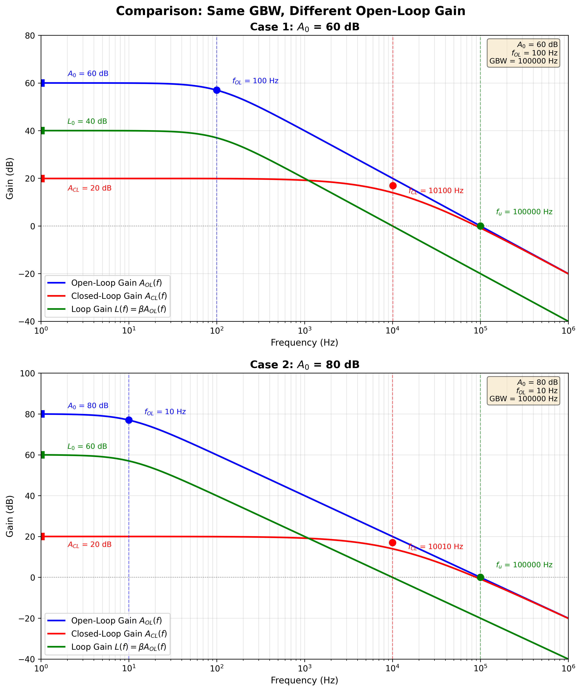

<!--
Input: figures/bandwidth_comparison.png, code/plot_bandwidth_comparison.py | Output: Bandwidth theory and GBW tradeoff guide | Position: Core technical document
⚠️ After any change, update this comment AND figures/.FOLDER.md and code/.FOLDER.md
-->
# Amplifier Bandwidth Calculations

## Gain-Bandwidth Product (GBW)

For a single-pole amplifier:

$$\boxed{\mathrm{GBW} = A_{\mathrm{v}} \cdot \mathrm{BW} = A_{\mathrm{0}} \cdot \omega_{p1}}$$

where $A_{\mathrm{v}}$ is closed-loop gain, $\mathrm{BW}$ is -3dB bandwidth, $A_{\mathrm{0}}$ is DC open-loop gain, and $\omega_{p1}$ is the dominant pole.

The unity-gain bandwidth:

$$\boxed{\omega_{\mathrm{u}} = \mathrm{GBW}}$$

## Closed-Loop Bandwidth

For negative feedback with feedback factor $\beta$:

$$A_{\mathrm{CL}} = \frac{A_{\mathrm{0}}}{1 + A_{\mathrm{0}} \beta} \approx \frac{1}{\beta} \quad \text{(when } A_{\mathrm{0}} \beta \gg 1\text{)}$$

$$\boxed{\mathrm{BW}_{\mathrm{CL}} = \mathrm{BW}_{\mathrm{OL}} \cdot (1 + A_{\mathrm{0}} \beta) \approx \frac{\mathrm{GBW}}{A_{\mathrm{CL}}}}$$

**Key Tradeoff:** Reducing gain increases bandwidth, while $\mathrm{GBW}$ remains constant.

## Bandwidth Comparison

The figure shows two cases with the same $\mathrm{GBW}$ but different open-loop gains:
- **Case 1 (60 dB)**: Lower open-loop gain, higher bandwidth at same closed-loop gain
- **Case 2 (80 dB)**: Higher open-loop gain, higher loop gain → better PSRR and distortion

All curves intersect at unity-gain frequency ($\mathrm{GBW}$), demonstrating gain-bandwidth conservation.

## For 5T Differential Amplifier

$$\boxed{\omega_{\mathrm{u}} = \frac{g_{\mathrm{m1}}}{C_{\mathrm{L}}}}$$

## Multi-Stage Bandwidth

For cascaded stages:

$$\frac{1}{\mathrm{BW}_{\mathrm{total}}^2} = \frac{1}{\mathrm{BW}_{\mathrm{1}}^2} + \frac{1}{\mathrm{BW}_{\mathrm{2}}^2} + \frac{1}{\mathrm{BW}_{\mathrm{3}}^2} + \ldots$$

For $n$ identical stages:

$$\mathrm{BW}_{\mathrm{total}} = \mathrm{BW}_{\mathrm{stage}} \cdot \sqrt{2^{1/n} - 1}$$
