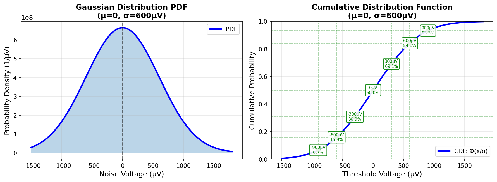
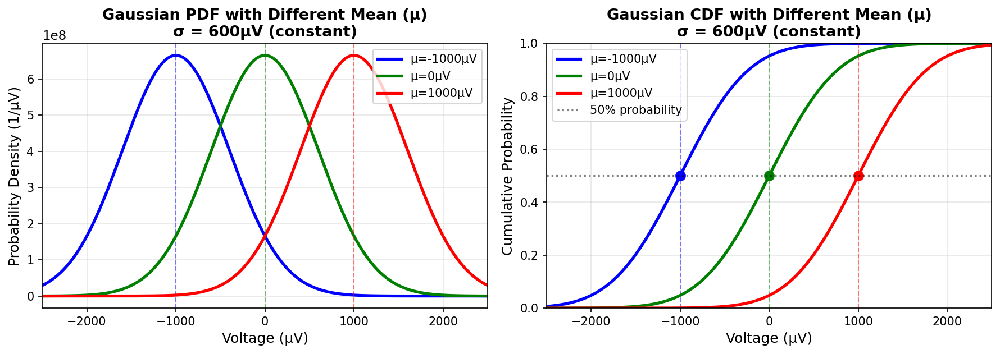
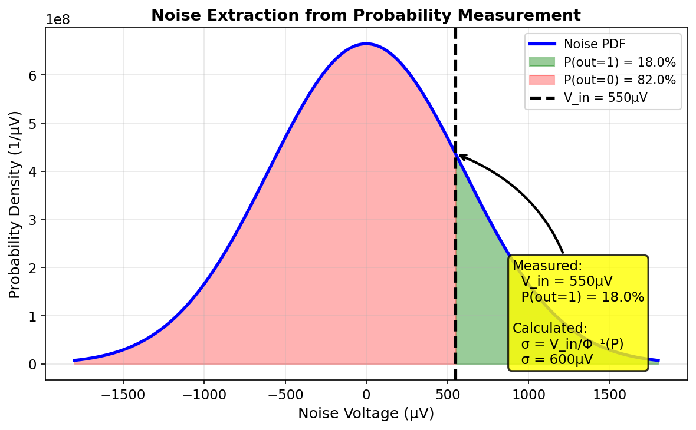
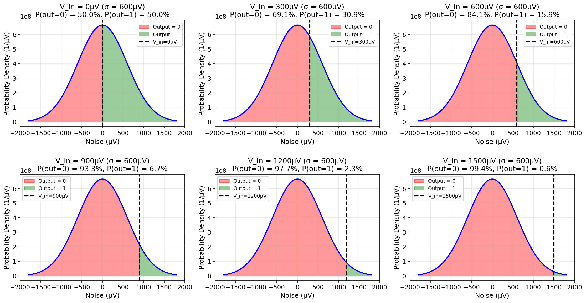

# Comparator Noise Calculation

<!--
Input: StrongArm comparator | Output: noise simulation methods | Position: comparator design
⚠️ After any change, update this comment AND relevant .FOLDER.md
-->

### Gaussian Distribution

For a random variable $x$ with mean $\mu$ and variance $\sigma^2$, the probability density function (PDF) is:

$$x \sim N(\mu, \sigma^2)$$

$$f(x) = \frac{1}{\sqrt{2\pi\sigma^2}} e^{-\frac{(x-\mu)^2}{2\sigma^2}}$$

The cumulative distribution function (CDF) gives the probability that $x \leq k$:

$$\Phi\left(\frac{k-\mu}{\sigma}\right) = P(x \leq k) = \int_{-\infty}^{k} f(x) dx$$

Therefore, the probability that $x > k$ is:

$$P(x > k) = 1 - \Phi\left(\frac{k-\mu}{\sigma}\right)$$

*Figure 1: Gaussian probability density function (left) and cumulative distribution function (right). The CDF shows the probability that noise is below a given threshold voltage.*

*Figure 2: Effect of different mean values (μ) on Gaussian distribution with constant σ = 600μV. The three curves show μ = -1mV, 0, and +1mV. Left: PDFs shift horizontally with changing μ. Right: CDFs shift horizontally, with 50% probability always occurring at x = μ.*

### Derivation of Noise Formula

For comparator noise with zero mean ($\mu = 0$):

$$P(x > k) = 1 - \Phi\left(\frac{k}{\sigma}\right)$$

Rearranging:

$$P(x \leq k) = \Phi\left(\frac{k}{\sigma}\right)$$

Taking the inverse CDF on both sides:

$$\frac{k}{\sigma} = \Phi^{-1}(P(x \leq k))$$

Solving for $\sigma$:

$$\sigma = \frac{k}{\Phi^{-1}(P(x \leq k))}$$

**For comparator:** If input signal is $V_{in}$ and output is "1" with probability $P$, then:

$$\sigma_{noise} = \frac{V_{in}}{\Phi^{-1}(P)}$$

This is the formula used in MATLAB: `sigma = Vin/norminv(P)`

*Figure 3: Illustration of noise extraction from probability measurement. By measuring the input voltage and output probability, we can calculate σ using the inverse Gaussian CDF formula.*

### Comparator Output Probability vs Input

The following figure shows how different input voltages affect the comparator output probability:

*Figure 4: Comparator output probability for different input voltages with σ = 600μV. As input voltage increases, the probability of correct output (output=1) increases from 50% to near 100%.*

## Figure of Merit

$$\text{FoM}_1 = V_n^2 \times P \quad [\mu V^2 \cdot nJ]$$

$$\text{FoM}_2 = V_n^2 \times P \times T_{cmp} \quad [\mu V^2 \cdot nJ \cdot ns]$$

Lower FoM is better. FoM₂ includes speed consideration.
